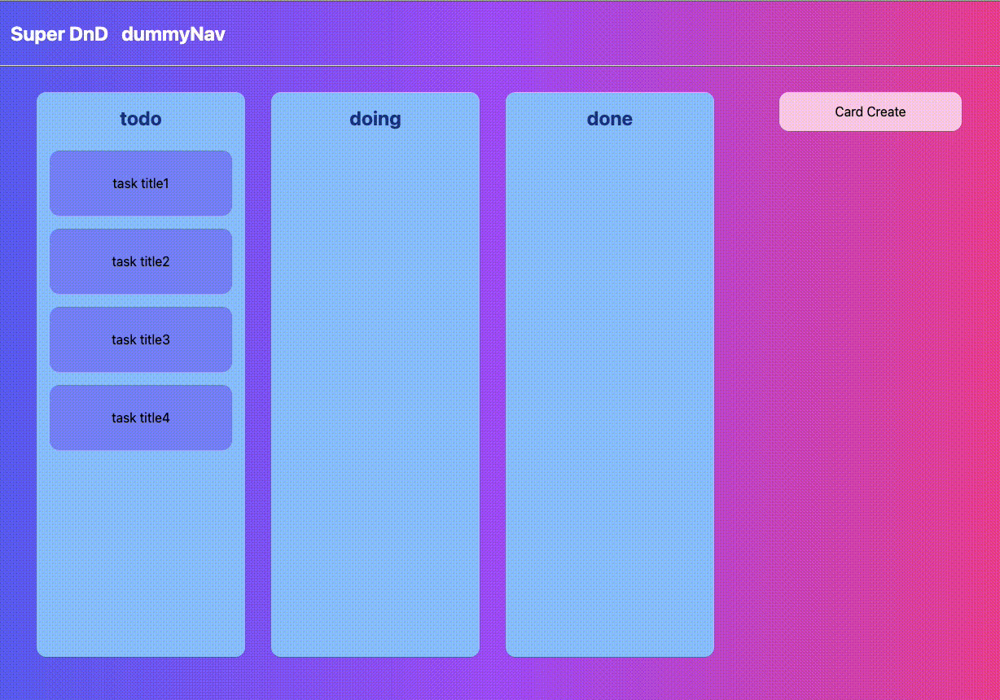

# typescript-react-html-drag-and-drop

HTML Drag & Drop API を利用したドラッグ&ドロップ



## SetUp

```
npm install
```

## Run

```
npm start
```

## Testing

### testing-library/react

```
npm test -- --coverage .
```

### Cypress

```
npm run cy:open
```

```
npm run cy:run
```

## Install Memo

```
npx create-react-app . --template typescript
```

## Tailwind

[Tailwind create-react-app](https://tailwindcss.com/docs/guides/create-react-app)

### Testing

React v18 に対応させるためバージョンアップさせる

```
npm install --save-dev @testing-library/react@latest
npm install --save-dev @testing-library/jest-dom@latest
npm install --save-dev @testing-library/user-event@latest
```

#### Cypress

```
npm install --save-dev cypress
```

`package.json` -> `scripts`

```
  "cy:open": "cypress open",
  "cy:run": "cypress run",
  "cy:run:chrome": "cypress run --browser chrome",
  "cy:run:firefox": "cypress run --browser firefox"
```

open(`./cypress`が作成されること。されたら開いた cypress ブラウザは閉じる)

```
npm run cy:open
```

`cypress.json` port は適時修正する

```
{
    "baseUrl": "http://localhost:3000"
}
```

GUI での sample テスト(`./cypress/integration/`配下にあるサンプルは削除し改めて`sample.test.ts`を配置)

```
// cli用（ワーニングは一旦無視）
import { cli } from 'cypress'

describe('Cypress', () => {
  it('Cypress動作確認', () => {
    expect(true).equal(true)
  })

  it('アプリの表示', () => {
    cy.visit('/')
  })
})
```

アプリの起動

```
npm start
```

Cypress を open しテスト

```
npm run cy:open
```

cli run

```
npm run cy:run
```

### redux-toolkit

```
npm install react-redux @types/react-redux @reduxjs/toolkit @types/node redux @types/redux
```

### MSW

```
npm install --save-dev msw
```

## Data Structure Memo

サーバサイド側を実装する際のデータ構造についてのメモ(users はユーザ単位で管理するためにとりあえず作成)

```
create database dnd;

drop table boards;
drop table todos;
drop table users;

create table users(
  id int unsigned not null auto_increment,
  nickname varchar(100) not null,
  email varchar(100) not null,
  primary key (id),
  unique key(email)
);

insert into users(nickname,email) values
('太郎','taro@example.com'),
('花子','hanako@example.com');

create table boards(
  id int unsigned not null auto_increment,
  user_id int unsigned not null,
  title varchar(100),
  primary key (id),
  constraint boards_fk_1 foreign key (user_id) references users (id)
);

insert into boards(user_id,title) values
(1,'todo'),
(1,'doing'),
(1,'done');

create table todos (
  id int unsigned not null auto_increment,
  user_id int unsigned not null,
  title varchar(100) not null,
  body text not null,
  board_id int unsigned not null,
  order_id int unsigned not null,
  primary key (id),
  unique key (board_id,order_id),
  constraint todos_fk_1 foreign key (board_id) references boards (id),
  constraint todos_fk_2 foreign key (user_id) references users (id)
);

insert into todos(user_id,title,body,board_id,order_id) values
(1,'title 1','body 1',1,1),
(1,'title 2','body 2',1,2),
(1,'title 3','body 3',1,3),
(1,'title 4','body 4',1,4);

```
